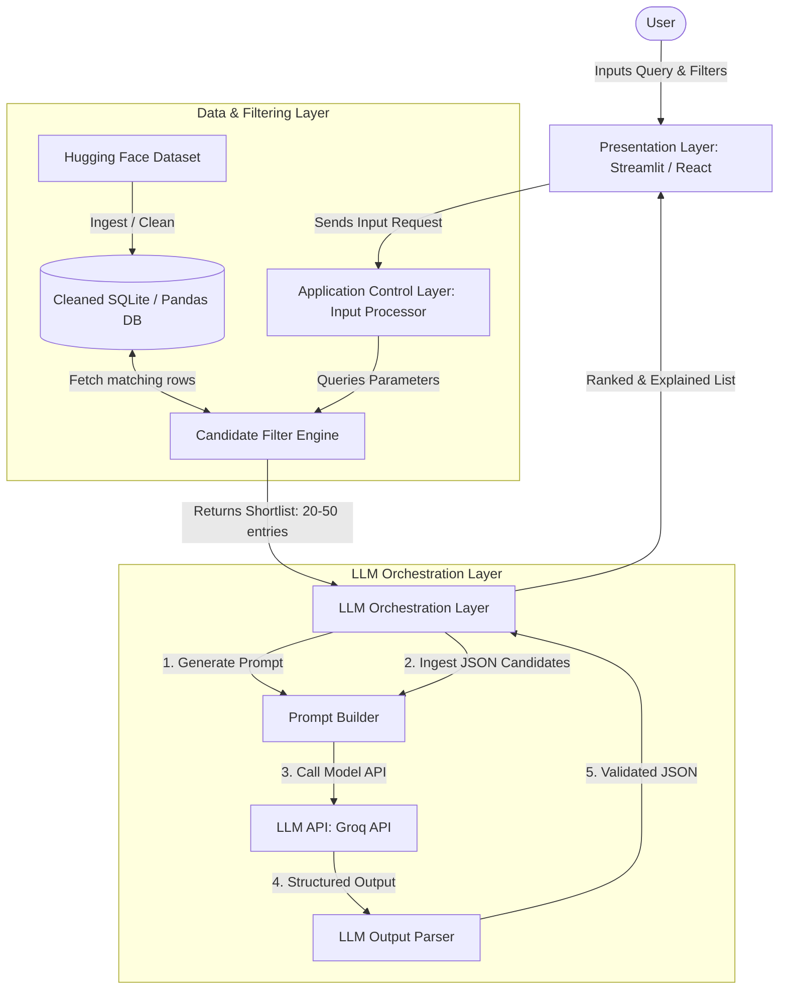
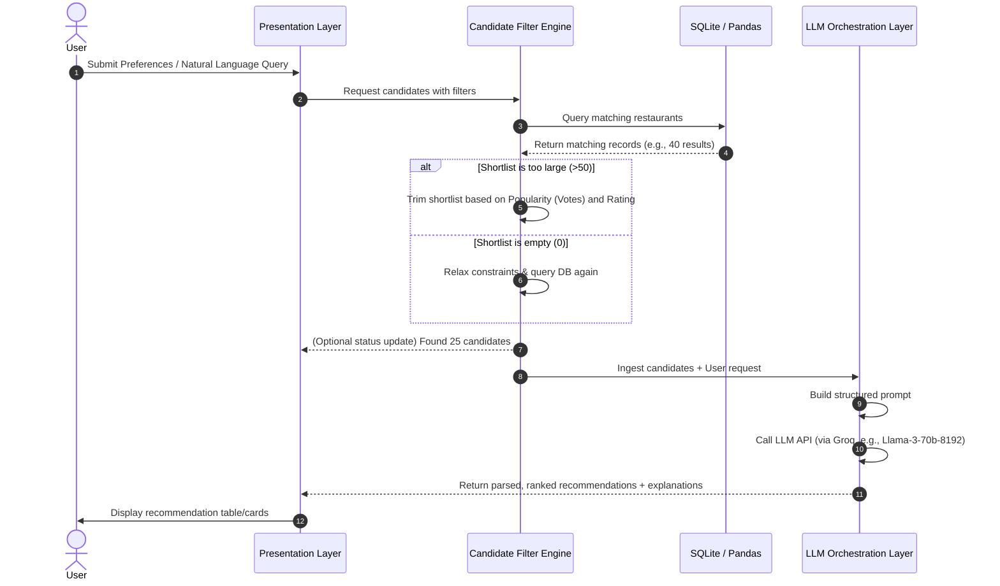

# Architecture Design: AI-Powered Restaurant Recommendation System

This document outlines the system architecture, component design, data flow, and technical specifications for the Zomato-inspired AI-Powered Restaurant Recommendation System, based on [context.md](file:///c:/Users/palla/OneDrive/Desktop/Zomato%20milestone1/context.md) and [Problem statement.txt](file:///c:/Users/palla/OneDrive/Desktop/Zomato%20milestone1/Docs/Problem%20statement.txt).

---

## 1. System Overview

The application follows a decoupled multi-tier architecture composed of:
1. **Presentation Layer (UI):** User interaction dashboard.
2. **Application Control Layer:** Request parsing and routing logic.
3. **Data & Filtering Layer:** Local storage, preprocessing, and hard-constraint candidate generation.
4. **LLM Orchestration Layer (Reasoning):** Context injection, prompt styling, LLM completion, and result parsing.



---

## 2. Component Breakdown

### A. Presentation Layer (User Interface)
- **Role:** Collects user dining requirements (location, budget, cuisine, rating, optional preferences) and displays final ranked recommendations with natural language reasoning.
- **Technologies:** Recommended to build using **Streamlit** (for fast, clean Python-based prototyping) or a **Vite + React** frontend.
- **Key Views:**
  - **Preference Panel:** Inputs for Mandatory constraints (Dropdowns/Sliders) and Optional tags (Checkboxes/Chips).
  - **Natural Language Query Box:** Allows users to paste unstructured text queries (e.g., *"Looking for authentic Italian in Bangalore under 1500..."*).
  - **Results Dashboard:** Table/Grid view displaying ranked cards with metrics (rating, cost) and custom LLM explanations.

### B. Application Control Layer (Input Processor)
- **Role:** Extracts inputs from the UI. If the input is a natural language text query, it parses variables using simple heuristics or a lightweight LLM extractor to populate the structured request object.
- **Output Schema:**
  ```json
  {
    "location": "Bangalore",
    "cuisine": "Italian",
    "max_budget": 1500,
    "min_rating": 4.2,
    "optional_preferences": {
      "family_friendly": true,
      "table_booking": true,
      "delivery": false,
      "outdoor_seating": false
    }
  }
  ```

### C. Data & Filtering Layer
- **Ingestion Pipeline:** Loads the Hugging Face dataset [ManikaSaini/zomato-restaurant-recommendation](https://huggingface.co/datasets/ManikaSaini/zomato-restaurant-recommendation), drops null values in critical fields (Name, Location, Cost, Rating), standardizes casing, and persists the cleaned data into an **SQLite Database** or **Pandas DataFrame** in memory.
- **Candidate Filter Engine:** Runs SQL query filters. For instance:
  ```sql
  SELECT name, location, cuisine, rating, cost, votes, type, online_order, book_table
  FROM restaurants
  WHERE LOWER(location) = LOWER(:location)
    AND cost <= :max_budget
    AND rating >= :min_rating
    AND (cuisine LIKE :cuisine_pattern)
  ```
- **Constraint Relaxation (Fallback):** If the database query returns `0` results (due to overly strict filters), the system automatically relaxes the rating threshold by `0.2` increments or expands the budget limit by `20%` and retries, ensuring the LLM always receives candidate options.

### D. LLM Orchestration Layer
- **Prompt Builder:** Combines system instructions, the user request context, and the shortlisted candidates (formatted as a dense, minified JSON array to minimize token usage) into a prompt template.
- **LLM API Client:** Connects to the LLM using the **Groq SDK** (utilizing models such as `llama3-70b-8192` or `llama3-8b-8192` for rapid, sub-second responses). It includes connection timeout handles (<3 seconds) and retry loops.
- **Output Parser:** Validates that the LLM returned a parseable array structure matching the expected schema. If the response contains invalid formatting, it runs a repair handler or falls back to traditional sorting as a fail-safe.

---

## 3. Data Flow & Lifecycle

The lifecycle of a single recommendation request proceeds as follows:



---

## 4. Prompt Engineering & LLM Architecture

### Prompt Design
The prompt is engineered for structured outputs. It instructs the LLM to output a JSON block only, without conversational markdown wrapping outside the code block.

#### System Prompt Template
```text
You are an expert culinary assistant and restaurant ranking agent. 
Your task is to rank the candidate restaurants and explain why they match the user's requirements.

CRITICAL RANKING CRITERIA:
1. Prioritize restaurants matching optional preferences (e.g., family-friendly, table booking).
2. Rank higher based on a combination of customer Rating and Popularity (number of Votes).
3. Ensure cost suitability relative to the budget limit.

OUTPUT FORMAT:
Provide your response in JSON format only. Do not include any explanation text before or after the JSON block.
```

#### User Prompt Template
```json
{
  "user_profile": {
    "location": "Bangalore",
    "budget_for_two": 1500,
    "cuisine": "Italian",
    "minimum_rating": 4.2,
    "preferences": ["family-friendly", "table booking"]
  },
  "candidate_restaurants": [
    {
      "id": 1,
      "name": "Trattoria Roma",
      "location": "Bangalore",
      "cuisine": "Italian, Pizza",
      "rating": 4.6,
      "cost_for_two": 1400,
      "votes": 850,
      "restaurant_type": "Casual Dining",
      "online_order": "Yes",
      "book_table": "Yes"
    },
    {
      "id": 2,
      "name": "Bella Italia",
      "location": "Bangalore",
      "cuisine": "Italian, Desserts",
      "rating": 4.4,
      "cost_for_two": 1200,
      "votes": 420,
      "restaurant_type": "Cafe",
      "online_order": "Yes",
      "book_table": "Yes"
    }
  ]
}
```

#### Expected JSON Response Schema
```json
{
  "recommendations": [
    {
      "rank": 1,
      "restaurant_name": "Trattoria Roma",
      "match_score": 95,
      "reason": "This restaurant is highly popular (850 votes) and offers an excellent 4.6 rating. It aligns with your Italian cuisine requirement, fits inside your budget at ₹1400, offers table booking, and has a family-friendly casual dining layout."
    },
    {
      "rank": 2,
      "restaurant_name": "Bella Italia",
      "match_score": 88,
      "reason": "An affordable option at ₹1200 for two, offering table booking. While its rating is slightly lower than Trattoria Roma, it is highly suitable for casual dining."
    }
  ],
  "recommendation_summary": "We recommend Trattoria Roma as the top choice for its excellent reviews and alignment with all requirements, followed by Bella Italia as a budget-friendly option."
}
```

---

## 5. Non-Functional Mechanics & Robustness

### Speed Optimization (<5s Target)
1. **In-Memory Pre-Filtering:** Applying SQL/DataFrame queries first shrinks the dataset from ~10,000 to ~25 candidates. This prevents prompt token bloat and keeps LLM latency low.
2. **Dataset Caching:** Ingested Hugging Face datasets are cached locally or in-memory so they are only downloaded/cleaned once.

### Error Handling & Fallbacks
- **Empty Dataset / Offline:** If the Hugging Face dataset fails to load, the system falls back to a bundled offline subset (`local_zomato_subset.csv`).
- **LLM Failure / Rate Limiting:** If the LLM API is unavailable, times out, or returns invalid syntax, the system triggers a **Heuristics Fallback Engine**, which ranks restaurants using a standard formula:
  $$\text{Score} = (\text{Rating} \times 0.6) + (\log(\text{Votes}) \times 0.4)$$
  Explanations are then filled using pre-formatted string templates.
